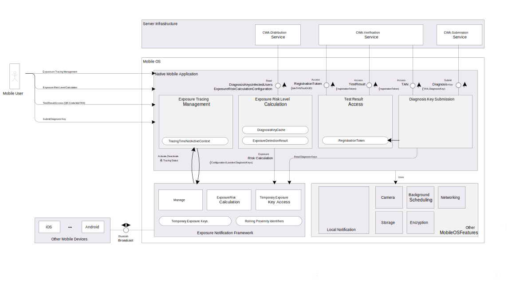

# Architecture Corona Warn App Mobile Client - iOS

This document outlines the architecture of the CWA mobile client. It not necessarily reflects the current implementation status in this repository and will be enriched in the future, as development is ongoing.

## Overview
The Corona Warn App Client ("CWA-Client") is a native mobile phone application developed for the mobile platforms iOS and Android. The CWA-Client is embedded into the overall Corona Warn App EcoSystem. (For an end-to-end overview please refer to the [Solution Architecture Overview](https://github.com/corona-warn-app/cwa-documentation/blob/master/solution_architecture.md))

The key functionality of the CWA-Client is divided into the following pillars:
1. Exposure Tracing Management: The reliable activation as well as configuration management of the Mobile OS Exposure Notification Tracing functionality.

2. Exposure Risk Level Calculation: The calculation of the exposure risk level using the detected exposure events as well as the exposure risk configuration data.

3. Test Result Access: Access COVID-19 test results by using a Test-GUID or a TeleTAN.

4. Diagnosis Key Submission: Allowing an COVID-19 positive tested user to share (submit) his TemporaryExposureKeys as DiagnosisKey.

### Exposure Tracing Management
The Exposure Tracing Management component uses the native implementation of the Exposure Notification Framework provided by Google and Apple to activate, deactivate or check the status of the tracing functionality. If exposure tracing is activated by the user the activation-status of needed technical services (e.g. Bluetooth) is verified as well. To calculate the Exposure Risk Level of the user the active tracing time is considered. As a result initial tracing activation timestamp as well as the time when tracing was deactivated during the last 14 days is persisted.

### Exposure Risk Level Calculation
The Exposure Risk Level Calculation is implemented using the native implementations of Google and Apple. To use the APIs with the needed data the client loads the available DiagnosisKeys for the calculation time range of 14 days from the [CWA-Distribution service](https://github.com/corona-warn-app/cwa-server/blob/master/docs/architecture-overview.md). To reduce the network footprint a local DiagnosisKey cache is used. With the diagnosisKeys the client passes the fresh downloaded exposure risk calculation configuration to the API of the mobile operation system. Finally the exposure risk level of the user is selected using the matched exposure risk level range for the maximum exposure risk happened in the last 14 days. The calculated exposure risk level and the exposure risk summary (maximumRiskScore, daysSinceLastExposure and matchedKeyCount) together with the calculation timestamp are stored on the client to allow the user the access to his latest calculation results when he is offline. The exposure risk level calculation is implemented as background online-only functionality ensuring that the latest diagnosisKeys as well as the latest configuration are used. If a risk level change happened during background processing a local notification is raised. For configuration and error scenarios during offline hours an assignment to error risk levels is implemented.

### Test Result Access
The Test Result Access component implements the HTTP choreography provided by the [CWA-Verification service](https://github.com/corona-warn-app/cwa-verification-server/blob/master/docs/architecture-overview.md). Using the testGUID (scanned as QR-Code) or the teleTAN (manually entered) the client receives a registration token which identifies a long term session. In the testGUID variant the client accesses the test result as online-only functionality. This ensures that the latest test data is shown and only the minimum needed data is stored on the client. To minimize the data footprint shared with other push technology server side infrastructures a periodic polling mechanism between client and CWA-Verification service checks in the background if a test result is available and informs the user via a local notification. In the teleTAN scenario no test result is retrieved using the registrationToken since the user is already known as COVID-19 positive.

### Diagnosis Key Submission
Once a user is tested positive the Diagnosis Key Submission component can be used. The software component uses the persisted registrationToken to access a Submission-TAN from the [CWA-Verification service](https://github.com/corona-warn-app/cwa-verification-server/blob/master/docs/architecture-overview.md). After accessing the Submission-TAN the available TemporaryExposureKeys are retrieved as DiagnosisKey by the corresponding mobile OS APIs. Every TemporaryExposureKey is enriched with the TransmissionRiskDefaultParameter fitting to the key creation day. The latest TransmissionRiskDefaultParameters are accessed by the [CWA-Distribution service](https://github.com/corona-warn-app/cwa-verification-server/blob/master/docs/architecture-overview.md). To allow in the future the introduction of subsequent TemporaryExposureKey submissions with delta semantics to the previous submission the timestamp of the last successful diagnosisKey submission is persisted.

## Cover iOS special aspects
### used Frameworks
The latest UI technology for iOS is SwiftUI which was introduced at WWDC 2019. As it was only released one year ago, we choose the traditional and more mature UIKit to develop this app.
### major used libraries
#### swift-protobuf
Protocol Buffers is used as the data exchange format between backend and frontend. [swift-protobuf](https://github.com/apple/swift-protobuf) is chosen to parse the data from backend.
#### Reachability.swift
We use the [Reachability.swift](https://github.com/ashleymills/Reachability.swift) library to detect the connectivity of internet.
#### fmdb
[fmdb](https://github.com/ccgus/fmdb) helps us to simplify the interface to access the SQLite database.
#### ZIPFoundation
[ZIPFoundation](https://github.com/weichsel/ZIPFoundation) is used to extract zip file that is downloaded from backend.
#### SQLCipher
We leverages the [SQLCipher](https://github.com/sqlcipher/sqlcipher) to encrypt the SQLite database protecting the users' privacy.

### used implementation patterns
#### UI Patterns
In general, the App is built with MVC and MVVM pattern. As the code is still under construction. Depending on the complexity of project in the future, some other patterns might be applied.
#### Others
The [Exposure Notification Framework](https://developer.apple.com/documentation/exposurenotification) supports KVO, so we also use KVO to watch the state of some important properties.
### Storage
There're two different storages which are used in the project. The random generated key is stored in [Keychain Services](https://developer.apple.com/documentation/security/keychain_services), and the other information is stored in the SQLite database that is encrypted by the [SQLCipher](https://github.com/sqlcipher/sqlcipher).
### Encryption
We use the popular [SQLCipher](https://github.com/sqlcipher/sqlcipher) library to encrypt the SQLite database.
